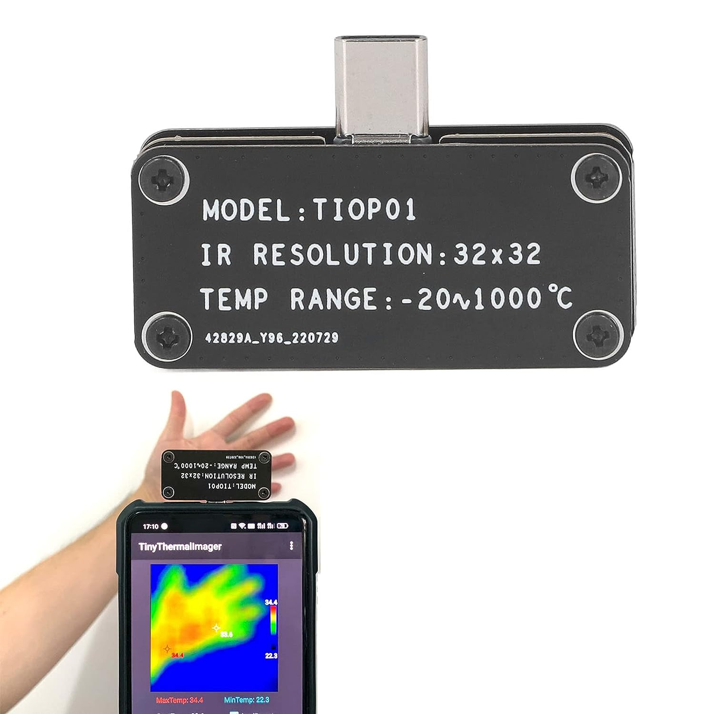

# Tiny Thermal Camera

Python interface for 32x32 tiny thermal camera:
* "TIOP01" on PCB
* "Tiny Thermal Imager(TIOPS2)" in dmesg

I got mine from Amazon, but also available on AliExpress / similar. Provided Android app was linked from https://www.pgyer.com/KWVl but I couldn't get it working.



# Usage

Example script will open an opencv preview window of the camera.

Press q in the preview window to exit, or ctrl+c in the terminal.

```sh
pip install -r requirements.txt
python ttc.py /dev/ttyACM0
# (Assuming you have permission to access the serial console)

```

# Camera Interface

Camera interfaces as a serial console:
* 921600 baud
* 8 data
* 1 stop
* 0 parity
* 0 flow control

Frames are read from serial in 2048 byte chunks (32x32x1 int16). The camera seems to provide data on frame boundaries, though sometimes I managed to get data shifted by a row or two.

Temperature in celcius is pixel value / 10.

Only known command is to set emissivity constant - Send 4 bytes
* 85
* 1
* emissivity constant - 10 to 100
* 85 + 1 + emissivity constant

I haven't tried any other commands, or discovered any through the Android app's code yet.
